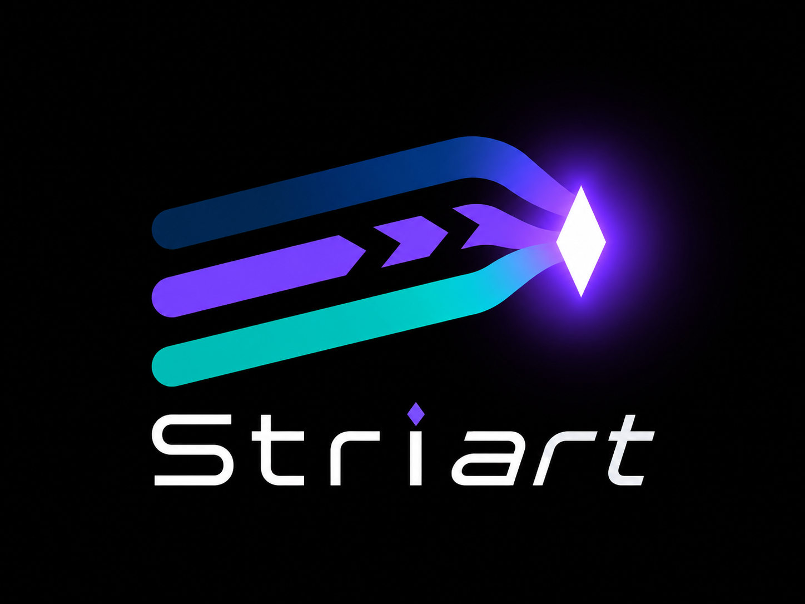

<h1 align="center">
  
</h1>

<p align="center">
  <strong>Multi-agent Git orchestrator</strong> for Claude Code, Aider, Cursor, and any other AI coding agent.<br>
  Physical isolation · Preventive routing · Semantic merging · Blocking Test Gate
</p>

<p align="center">
  
  
  
  
  
</p>

<p align="center">
  <a href="#why-striart--and-not-just-worktrees">Why Striart</a> ·
  <a href="#installation">Installation</a> ·
  <a href="#quick-start">Quick start</a> ·
  <a href="#documentation">Documentation</a> ·
  <a href="#golden-rules">Golden rules</a>
</p>

<p align="center"><em>🇫🇷 <a href="README.fr.md">Version française</a> — this is the default (English) README; the French version remains the content reference.</em></p>

When several AI agents work on the same repo in parallel, they trample each other:
Git conflicts, greedy commits, semantically broken merges. Striart solves this with three pillars:

1. **Physical isolation** — each agent works in a real, independent Git clone with no remote (`.striart/agents/<name>/`).
2. **Preventive Router** — before launching an agent, an LLM predicts which files will be touched and queues colliding tasks.
3. **Semantic merge + Test Gate** — agent commits are merged automatically; on conflict, an LLM merges the code; nothing is committed until `npm test` (or your command) passes.

Striart is not an opaque central brain: it's a **Git pacemaker**. The human sees everything and can interrupt, correct, or approve.

---

## Why Striart — and not just worktrees?

Isolating files is 10% of the problem. A worktree (or a hand-made clone)
keeps two agents from writing to the same place *at the same time* — all the
rest stays on you, for every task: avoiding collisions *before* they happen,
bringing N branches back into the target branch, arbitrating conflicts,
guaranteeing nothing broken gets in. Striart automates precisely that rest.

| Need | Hand-managed worktrees | Claude Code subagents (built-in worktrees) | Striart |
|---|---|---|---|
| File isolation | ✅ | ✅ (zero friction) | ✅ full clones |
| Resilience to an agent going off the rails | ⚠️ shared `.git/`: a `reset --hard` or `gc` touches shared state | ⚠️ same | ✅ own refs/index, no remote, secrets excluded — blast radius bounded to the clone |
| Collision prevention | ❌ on you | ❌ depends on the model's task split | ✅ LLM Router + queue + `--after` dependencies |
| Getting work back into the target branch | ❌ manual merges | ❌ up to the agent | ✅ auto-merge, rebase of every agent after each merge, 3-way semantic merge |
| Quality gate | ❌ | ❌ | ✅ **blocking Test Gate** — nothing lands without a green suite |
| Multi-vendor | ❌ | ❌ Claude only | ✅ Claude + Aider + Codex + Ollama… side by side |
| Lifespan | the session | the session | ✅ hours/days, multiple sessions, persistent queue |
| Observability & control | ❌ | session-bound | ✅ real-time dashboard, persistent logs, semi-autonomous (you arbitrate permissions), rollback |

The full reasoning (clones vs worktrees, nesting with Claude Code's
subagents, MCP/ACP symmetry) is in
**[docs/en/architecture.md](docs/en/architecture.md)**.

---

## Installation

From source:

```bash
git clone https://github.com/personamanagmentlayer/striart.git
cd striart && npm install && npm link   # exposes the `striart` command
cd /path/to/my-project
striart init
```

Prerequisites: Node.js 22.18+ (native type stripping — nothing to compile),
Git, **a Git repository with at least one commit**, and an LLM for the
Router/Merger — local Ollama (default) **or** any cloud API. Full details:
**[docs/en/getting-started.md](docs/en/getting-started.md)**.

---

## Quick start

```bash
cd my-project
striart init                          # creates .striart/, the config, checks the LLM

# Tab 1 — the orchestrator
striart watch                         # automatic merge + Test Gate + rebase

# Launch agents (the Router checks for collisions before each launch)
striart run "Refactor the authentication module" --command "claude" --open
striart run "Add Stripe billing" --agent billing --command "aider --model gpt-4o" --open

# ...and for a well-scoped task you don't want to babysit, Striart drives alone:
striart run "Add unit tests to src/parser.js" --autonomous --profile claude

# Monitoring
striart status / queue / dashboard / resolve
```

---

## Documentation

The complete documentation lives in **[docs/en/](docs/en/README.md)**
(🇫🇷 [docs/fr/](docs/fr/README.md) — the French version is the reference):

| Page | Content |
|---|---|
| [Getting started](docs/en/getting-started.md) | Prerequisites, installation, `striart init`, the "3 agents in parallel" guide. |
| [Architecture](docs/en/architecture.md) | Clones vs worktrees, serialized chain, commit flow, the 6 sync statuses, locks. |
| [Commands](docs/en/commands.md) | The 21 commands in detail: options, safeguards, refusal codes. |
| [Configuration](docs/en/configuration.md) | Full `striart.config.mjs` reference, LLM providers, prompts. |
| [Branches and pipeline](docs/en/branches.md) | `targetBranch` on any branch (`dev`, `master`…), staging → main pipeline. |
| [Execution modes](docs/en/execution-modes.md) | Supervised, autonomous, ACP, semi-autonomous (permission arbitration). |
| [Plans](docs/en/plans.md) | Tasks-as-code: the versioned YAML task graph. |
| [MCP server](docs/en/mcp.md) | Driving Striart from Claude Code, Cursor, or any MCP host. |
| [Large projects](docs/en/large-projects.md) | Keeping the disk cost of clones in check. |
| [Troubleshooting](docs/en/troubleshooting.md) | `striart doctor`, error codes, tickets, `rollback`, `reconcile`. |

---

## Golden rules

1. **Never push from an agent.** Clones are islands with no remote; only the orchestrator pushes.
2. **Never commit without a green Test Gate.** Even if the merging LLM is "sure of itself".
3. **Never delete a clone while an agent is working.** `striart clean` refuses at two levels: `IN_USE` (heuristic, `--force` possible knowingly) and `SESSION_LIVE` (verified fact, which **`--force` cannot override**).
4. **Mandatory human fallback.** 3 failed semantic merges in a row → manual mode until `striart resolve --unlock`, with a complete ticket per failure in `.striart/conflicts/`.

---

## Development

**422 tests** (244 unit + 178 integration on real Git repos), `tsc` typecheck
over all the code (native TS + JSDoc-annotated JS), zero build step — `bin`
points at the source.

```bash
npm install
npm run test:unit        # 244 tests, ~20 s — the dev loop
npm run test:integration # 178 tests, ~7 min — real temporary Git repos
npm test                 # both
npm run lint             # ESLint (correctness) + Prettier --check
npm run test:ci          # typecheck + everything + coverage
```

See [CONTRIBUTING.md](CONTRIBUTING.md) and [SECURITY.md](SECURITY.md).

MIT license.
